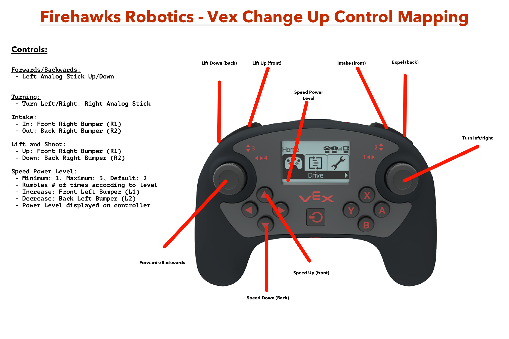

# VEX-Change-Up
Programming for our VEX Robot for the VEX Change Up game of 2020-2021

## Workflow (Important!)

All changes should be done via the following workflow (see note below):

1. Make changes only to the controls program (even whe only changing autonomous)
2. When done making changes, run `./cp_autonomous` to copy the changes over to the autonomous programs (see note below).

NOTE: If you are using a computer that cannot run bash scripts, then dont worry about using the `cp_autonoumous` script (and shame on you). However, you should still only do work on the controls program. Once you are on a computer that can run the script, then do it (or someone else on one that can run it can instead). This streamlines the programming for the autonomous (see the side.h source file for a more in-depth explanation).

## Git Branch Model

Contributers should follow the Git branch model described in the [linked article](https://nvie.com/posts/a-successful-git-branching-model/).

## Control Mapping

Below is the control mapping for using the robot

